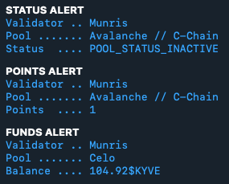
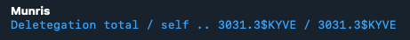

# Kyve pools monitoring

For beta now.

Will alert you when pool is out of funds, when your pool have more than 0 points or status is not Active. Also can inform you about your stake in different chat once an hour.




Environmental Variables:
- `API_URL`: Api endpoint for request
- `VALOPER`: Your validator operator address
- `TOKEN_FUNDS_ALERT`: Amount of funds in pool to alert
- `TELEGRAM_TOKEN`: Telegram Token
- `TELEGRAM_CHAT_ALERT_ID`: Telegram Chat ID for alerts
- `TELEGRAM_CHAT_INFO_ID`: Telegram Chat ID for info about delegation. Optional, remove or comment to disable

Refer to the config.ini.example for a template to populate.

Install python3 and install from the requirements file: <br>
```pip3 install -r requirements.txt```

Copy and populate the config.ini file with the necessary information: <br>
```cp config.ini.example config.ini```

Run the script:<br>
`python3 ./monitoring.py` <br>
Note: It will read in the configuration file local to the path of the script if not specified. <br>

## Add Cronjob

```1,11,21,31,41,51 * * * * /usr/bin/python3 /home/kyve-pool-monitoring/monitoring.py```